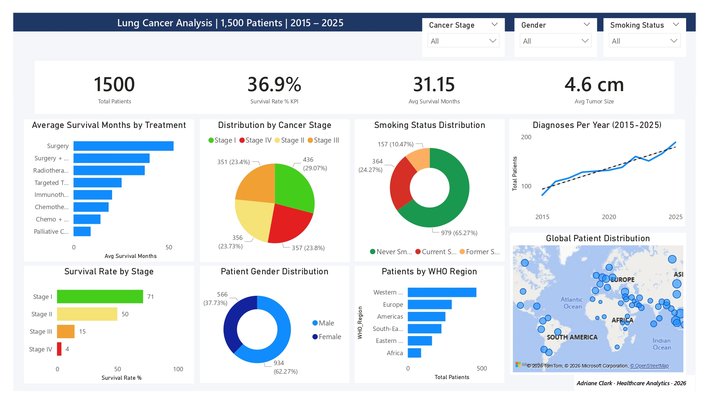

# Exploratory-Data-Analysis-on-Lung-Cancer-Patient-Trends-and-Indicators 🫁  

> An end-to-end data analytics project examining **1,500 lung cancer patients** across 6 WHO regions (2015–2025), covering data cleaning, SQL querying, Excel modeling, and Power BI dashboard design.

---

## 📸 Dashboard Preview



> *Built in Power BI Desktop — 1-page interactive dashboard with slicers for Stage, Gender, and Smoking Status.*

---

## 📁 Repository Structure

```
lung-cancer-analysis/
│
├── 📂 data/
│   └── lung_cancer_dataset.csv          ← Raw source data (1,500 rows · 41 columns)
│
├── 📂 sql/
│   └── lung_cancer_queries.sql          ← 25+ queries across 8 sections (MySQL)
│
├── 📂 assets/
│   ├── dashboard_preview.png            ← Screenshot of the Power BI dashboard
│   └── lung_cancer_analysis.xlsx        ← Excel workbook (5 sheets)
│
├── 📂 pbix/
│   └── lung_cancer_dashboard.pbix       ← Power BI Desktop file
│
└── README.md                            ← You are here
```

---

## 🎯 Business Questions Answered

1. What is the overall survival rate, and how does it vary by cancer stage?
2. Which treatment type produces the best survival outcomes?
3. Are smokers more likely to be diagnosed at a later stage?
4. Which WHO regions have the highest patient burden?
5. How has the annual number of diagnoses trended from 2015 to 2025?
6. What is the relationship between tumor size and cancer stage?

---

## 📊 Dataset — `/data`

**File:** `data/lung_cancer.csv`

| Column | Type | Description |
|--------|------|-------------|
| `Patient_ID` | Text | Unique patient identifier |
| `Diagnosis_Year` | Integer | Year of diagnosis (2015–2025) |
| `Age` | Integer | Patient age at diagnosis (30–89) |
| `Gender` | Text | Male / Female |
| `Smoking_Status` | Text | Never Smoked / Current Smoker / Former Smoker |
| `Cancer_Stage` | Text | Stage I / II / III / IV |
| `Treatment` | Text | Surgery, Chemotherapy, Immunotherapy, etc. |
| `Tumor_Size_cm` | Decimal | Tumor diameter in centimeters |
| `Metastasis` | Yes/No | Whether cancer has spread |
| `Survival_Months` | Integer | Months survived after diagnosis |
| `Survived` | Yes/No | Patient outcome at end of study period |

> 41 total columns. See full data dictionary in the [Analysis Report](ANALYSIS_REPORT.md).

---

## 🗄️ SQL Queries — `/sql`

**File:** `sql/lung_cancer_queries.sql`

25+ queries organized into 8 labeled sections. Every query has a plain-English comment above it explaining what it does.

| Section | What It Covers |
|---------|---------------|
| Section 1 | Data exploration — COUNT, NULL check, DISTINCT |
| Section 2 | Patient demographics — GROUP BY, percentages, age bands |
| Section 3 | Risk factors — CASE WHEN scoring, multi-factor counts |
| Section 4 | Tumor & stage analysis — AVG, MIN, MAX, metastasis counts |
| Section 5 | Survival analysis — survival rate, avg months, top 10 survivors |
| Section 6 | Window functions — RANK(), PERCENT_RANK(), rolling averages, cumulative totals |
| Section 7 | Subqueries — above-average tumor size, stages above avg survival |
| Section 8 | CREATE VIEW — reusable summary for Power BI or reporting |

**Sample — Survival Rate by Stage:**
```sql
SELECT
    Cancer_Stage,
    COUNT(*) AS total,
    ROUND(SUM(CASE WHEN Survived = 'Yes' THEN 1 ELSE 0 END)
          * 100.0 / COUNT(*), 1) AS survival_rate_pct,
    ROUND(AVG(Survival_Months), 1) AS avg_survival_months
FROM lung_cancer
GROUP BY Cancer_Stage
ORDER BY Cancer_Stage;
```

**Sample — Rank Treatments Within Each Stage (Window Function):**
```sql
SELECT
    Cancer_Stage,
    Treatment,
    survival_rate_pct,
    RANK() OVER (
        PARTITION BY Cancer_Stage
        ORDER BY survival_rate_pct DESC
    ) AS rank_within_stage
FROM ( ... ) subquery
ORDER BY Cancer_Stage, rank_within_stage;
```

---

## 📈 Power BI Dashboard — `/pbix` + `/assets`

**Files:**
- `pbix/dash.pbix` — open in Power BI Desktop
- `assets/dashb.png` — screenshot preview

**The 1-page dashboard contains:**

| Visual | Type | Description |
|--------|------|-------------|
| KPI Cards | Card ×4 | Total Patients · Survival Rate · Avg Survival Months · Avg Tumor Size |
| Survival by Stage | Bar chart | Survival % per stage, color-coded I→IV |
| Treatment Outcomes | Horizontal bar | Avg survival months ranked by treatment |
| Smoking Breakdown | Donut chart | Never / Former / Current smoker split |
| Gender Distribution | Donut chart | Male vs Female patient count |
| Stage Distribution | Pie chart | Stage I–IV proportions |
| Diagnosis Trend | Line chart | Annual new diagnoses 2015–2025 with trend line |
| Regional Burden | Bar / Map | Patient count by WHO Region |
| Slicers ×3 | Filters | Cancer Stage · Gender · Smoking Status |

**Sample DAX Measures:**
```dax
Total Patients = COUNTROWS(lung_cancer_dataset)

Survival Rate % =
DIVIDE(
    COUNTROWS(FILTER(lung_cancer_dataset, lung_cancer_dataset[Survived] = "Yes")),
    COUNTROWS(lung_cancer_dataset),
    0
)

Avg Survival Months = AVERAGE(lung_cancer_dataset[Survival_Months])

Stage IV Count =
CALCULATE(
    COUNTROWS(lung_cancer_dataset),
    lung_cancer_dataset[Cancer_Stage] = "Stage IV"
)
```

---

## 🗂️ Excel Workbook — `/assets`

**File:** `assets/lung_cancer_analysis.xlsx`

The workbook has 5 sheets:

| Sheet | Contents |
|-------|----------|
| **Raw Data** | All 1,500 rows formatted with alternating row colors and frozen header |
| **Summary Stats** | KPI cards using live formulas + stage, treatment, and smoking breakdowns |
| **Pivot Analysis** | Stage × Treatment survival table, Gender × Stage survival rates, patients by region |
| **Recommendations** | 5 color-coded findings with action recommendations |
| **Formulas Guide** | Reference sheet — every formula used, explained in plain English |

**Key Excel formulas used:**

| Formula | Purpose |
|---------|---------|
| `=COUNTA(range)` | Count total patients |
| `=COUNTIF(range, "Yes")` | Count survived patients |
| `=AVERAGE(range)` | Average age / survival months / tumor size |
| `=COUNTIF(...) / COUNTA(...)` | Survival rate percentage |
| `=AVERAGEIF(range, criteria, avg_range)` | Avg survival for one specific stage |
| `=COUNTIFS(r1, c1, r2, c2)` | Multi-condition count (e.g., Male + Stage IV) |
| `=IFERROR(formula, "N/A")` | Catch and handle divide errors |
| `=SUM(range)` | Totals rows in summary tables |

---

## 🔍 Key Findings

### Finding 1 — Early Detection Saves Lives

| Stage | Survival Rate | Avg Survival |
|-------|-------------|-------------|
| Stage I | ~71% | ~54 months |
| Stage II | ~50% | ~34 months |
| Stage III | ~15% | ~18 months |
| Stage IV | ~4% | ~7 months |

Stage I patients survive at **4–5× the rate** of Stage IV patients. The biggest lever in lung cancer outcomes is simply catching it earlier.

### Finding 2 — Surgery Produces the Best Outcomes
Surgery (alone or combined with chemo) leads to the highest average survival months. Palliative care — typically administered at Stage IV — has the lowest, reflecting the stage of diagnosis rather than treatment failure.

### Finding 3 — 65% of Patients Never Smoked
The majority of patients in this dataset never smoked. Secondhand smoke, high air pollution, genetic mutations (KRAS, EGFR), and occupational hazards are significant contributors that are often underemphasized in public health messaging.

### Finding 4 — Western Pacific Has the Highest Patient Burden
The Western Pacific region (China, Japan, Singapore) accounts for the largest share of diagnoses, consistent with elevated smoking rates and poor air quality in major cities in the region.

---

## 💡 Recommendations

1. **Implement LDCT screening** for high-risk adults aged 50+ (current and former smokers)
2. **Rethink messaging** — 65% of patients never smoked; air quality and genetics need more attention
3. **Fast-track surgical assessment** at time of diagnosis — the treatment window closes fast
4. **Expand Asia-Pacific oncology resources** — the Western Pacific carries a disproportionate burden
5. **Add genetic mutation testing** (KRAS, EGFR) at diagnosis to guide targeted therapy eligibility

---

## 🚀 How to Use This Project

### Step 1 — Explore the Data
```
Open: data/lung_cancer_dataset.csv
Tool: Excel, MySQL Workbench, or any CSV viewer
```

### Step 2 — Run the SQL Queries
```
Tool:  MySQL Workbench 8.0+
File:  sql/lung_cancer_queries.sql
Steps: Import the CSV first → then run queries section by section
       Each query has a comment above it explaining what it does
```

### Step 3 — Open the Excel Workbook
```
Tool:  Microsoft Excel 2021 / 365
File:  assets/lung_cancer_analysis.xlsx
Start: Raw Data sheet → Summary Stats → Pivot Analysis → Recommendations
```

### Step 4 — Open the Power BI Dashboard
```
Tool:  Power BI Desktop (free at powerbi.microsoft.com)
File:  pbix/lung_cancer_dashboard.pbix
Note:  If data path breaks, re-point the source to data/lung_cancer_dataset.csv
```

---

## 🛠️ Tools and Technologies

| Tool | Version | Used For |
|------|---------|----------|
| Microsoft Excel | 2021 / 365 | Data cleaning, formulas, pivot analysis |
| MySQL Workbench | 8.0+ | SQL querying and analysis |
| Power BI Desktop | Latest | Interactive 1-page dashboard |
| Python (pandas) | 3.10+ | Initial data exploration |

---

## Author

Adriane Clark Ballesteros  
Healthcare Data Analyst Trainee

* 🔗 GitHub: https://github.com/acbshields12

---

*Project built as part of a healthcare analytics portfolio. Dataset is sourced from Kaggle.com.*
